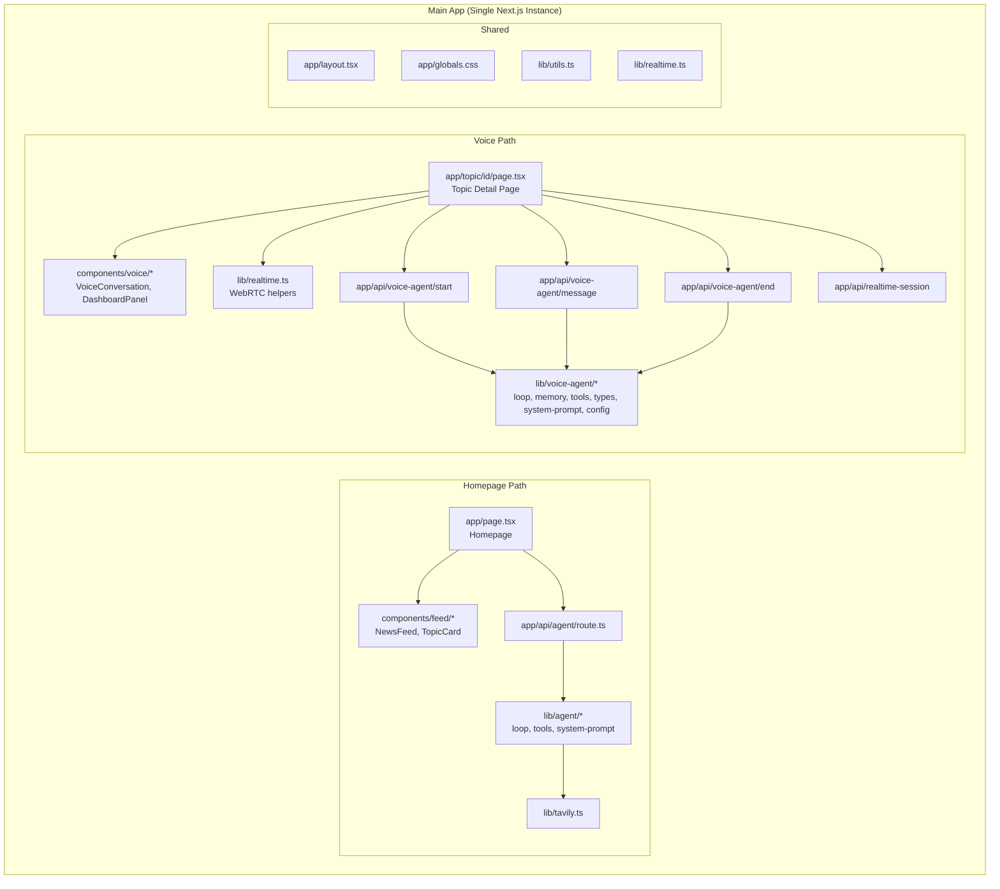

# Design Document: Voice Agent Migration

## Overview

This design describes the structural migration of the voice-agent feature from its standalone sub-project (`voice-agent/`) into the main New News Next.js application. The migration consolidates two separate Next.js apps into one, placing the voice conversation experience on a topic detail page (`/topic/[id]`) while leaving the existing homepage, headline-feed agent, and all current functionality untouched.

The migration is purely structural — no new features are added. The voice-agent sub-project's components, server logic, API routes, and styles are relocated into the main app's directory structure with updated import paths. After migration, the main app serves both the news feed homepage and the voice conversation topic page from a single Next.js instance.

### Key Design Decisions

1. **Single Next.js app**: Eliminates the operational complexity of running two separate Next.js servers. Both features share one build, one `package.json`, and one deployment.
2. **Namespace separation via directories**: Voice components live under `components/voice/`, voice server logic under `lib/voice-agent/`, and voice API routes under `app/api/voice-agent/`. This prevents any collision with the existing `lib/agent/` and `app/api/agent/` namespaces.
3. **Additive-only changes to shared files**: `app/layout.tsx`, `app/globals.css`, `lib/realtime.ts`, and `package.json` are modified by merging in only what the voice feature requires — never by overwriting.
4. **Preserve the existing `app/api/realtime-session/route.ts`**: The main app already has this route. The voice-agent version adds `topicContext` support. The migration replaces the existing route with the voice-agent version, which is a strict superset (it falls back to default instructions when `topicContext` is absent).

## Architecture

The migrated application has two independent feature paths that share infrastructure but do not interact at runtime:



### Routing Structure

| Route | Purpose | Source |
|---|---|---|
| `/` | Homepage with news feed | Existing `app/page.tsx` (unchanged) |
| `/topic/[id]` | Voice conversation for a topic | Migrated from `voice-agent/app/topic/[id]/page.tsx` |
| `/api/agent` | Headline-feed agent | Existing `app/api/agent/route.ts` (unchanged) |
| `/api/realtime-session` | OpenAI Realtime session creation | Replaced with voice-agent version (superset) |
| `/api/voice-agent/start` | Start voice agent session | Migrated from `voice-agent/app/api/voice-agent/start/route.ts` |
| `/api/voice-agent/message` | Send follow-up message | Migrated from `voice-agent/app/api/voice-agent/message/route.ts` |
| `/api/voice-agent/end` | End voice agent session | Migrated from `voice-agent/app/api/voice-agent/end/route.ts` |

## Components and Interfaces

### Migrated Components

#### `components/voice/VoiceConversation.tsx`

This is the standalone voice conversation component from `voice-agent/components/VoiceConversation.tsx`. It is a `"use client"` component that manages WebRTC connections, microphone access, transcript display, and audio playback. It is **not used** on the topic detail page (which has its own inline voice logic), but is preserved for potential standalone use.

**Changes from original:**
- Import paths updated from `@/lib/realtime` → `@/lib/realtime` (same alias, different root)
- Import paths updated from `@/components/ui/*` → `@/components/ui/*` (same alias, different root)
- No functional changes

#### `components/voice/DashboardPanel.tsx`

Migrated from `voice-agent/components/topic/DashboardPanel.tsx`. Renders source cards in the topic detail page sidebar.

**Changes from original:**
- Import `DashboardItem` from `@/lib/voice-agent/types` instead of `@/lib/voice-agent/types` (same alias path after migration)
- Import `Badge`, `Card`, etc. from `@/components/ui/*`
- Import `cn` from `@/lib/utils`
- No functional changes

#### `app/topic/[id]/page.tsx`

Migrated from `voice-agent/app/topic/[id]/page.tsx`. This is the main topic detail page — a large `"use client"` component that orchestrates:
- Topic loading (from sessionStorage or mock fallback)
- Voice agent research phase (calls `/api/voice-agent/start`)
- WebRTC voice connection (calls `/api/realtime-session` with topic context)
- Follow-up message handling (calls `/api/voice-agent/message`)
- Session cleanup on unmount (calls `/api/voice-agent/end`)
- Dashboard panel rendering with source cards

**Changes from original:**
- All imports updated to use `@/` aliases pointing to main app paths
- `@/components/topic/DashboardPanel` → `@/components/voice/DashboardPanel`
- `@/lib/voice-agent/types` → `@/lib/voice-agent/types` (same path after migration)
- `@/lib/realtime` → `@/lib/realtime` (same path after migration)
- `@/lib/utils` → `@/lib/utils` (same path after migration)
- `lucide-react` imports remain unchanged
- No functional changes

### Migrated API Routes

#### `app/api/realtime-session/route.ts`

**Replaces** the existing main app version. The voice-agent version is a strict superset:
- Accepts an optional `topicContext` field in the POST body
- When `topicContext` is provided, uses it as the Realtime API session instructions
- When `topicContext` is absent, falls back to the same default instructions the current main app version uses
- Uses `NextRequest` instead of bare `Request` for body parsing

**Interface:**
```typescript
// POST /api/realtime-session
// Request body (optional):
interface RealtimeSessionRequest {
  topicContext?: string;  // Topic-aware voice instructions
}
// Response: OpenAI Realtime session object with client_secret
```

#### `app/api/voice-agent/start/route.ts`

Migrated from `voice-agent/app/api/voice-agent/start/route.ts`. Creates a new voice-agent session and runs initial research.

**Interface:**
```typescript
// POST /api/voice-agent/start
// Request body:
interface VoiceAgentStartRequest {
  topic: Topic;  // from lib/voice-agent/types
}
// Response: StartResponse (sessionId, spokenSummary, suggestedQuestions, dashboardItems, metadata)
```

#### `app/api/voice-agent/message/route.ts`

Migrated from `voice-agent/app/api/voice-agent/message/route.ts`. Handles follow-up messages within an existing session.

**Interface:**
```typescript
// POST /api/voice-agent/message
// Request body:
interface VoiceAgentMessageRequest {
  sessionId: string;
  message: string;
}
// Response: MessageResponse (reply, dashboardItems, metadata, limitReached)
```

#### `app/api/voice-agent/end/route.ts`

Migrated from `voice-agent/app/api/voice-agent/end/route.ts`. Terminates a voice-agent session.

**Interface:**
```typescript
// POST /api/voice-agent/end
// Request body:
interface VoiceAgentEndRequest {
  sessionId: string;
}
// Response: { success: true }
```

### Migrated Server Logic

#### `lib/voice-agent/` directory

All files migrated from `voice-agent/lib/voice-agent/`:

| File | Purpose |
|---|---|
| `loop.ts` | Agent loop orchestration — initial research and follow-up handling |
| `memory.ts` | In-memory session store (Map-based) |
| `system-prompt.ts` | Builds the voice agent system prompt for a topic |
| `tools.ts` | Tool implementations — Tavily search, viewpoint classification, briefing generation |
| `types.ts` | Voice agent type definitions (Topic, Source, Session, etc.) |
| `config.ts` | Voice agent configuration constants (migrated from `voice-agent/lib/config.ts`) |

**Import changes:** All internal imports within `lib/voice-agent/` use relative paths (e.g., `./types`, `./memory`, `../config`). After migration, these become `@/lib/voice-agent/types`, `@/lib/voice-agent/memory`, `@/lib/voice-agent/config` — or remain relative since they're in the same directory. The key change is that `voice-agent/lib/config.ts` (which contains `VOICE_AGENT_CONFIG`) moves to `lib/voice-agent/config.ts`, so imports from `../config` in the original become `./config` or `@/lib/voice-agent/config`.

### Modified Shared Files

#### `lib/realtime.ts`

The main app already has this file. The voice-agent version adds an optional `topicContext` parameter to `fetchSessionToken`. The migration replaces the main app version with the voice-agent version, which is a strict superset:

```typescript
// Before (main app):
export async function fetchSessionToken(): Promise<{ client_secret: { value: string } }>

// After (merged):
export async function fetchSessionToken(topicContext?: string): Promise<{ client_secret: { value: string } }>
```

When called without arguments, behavior is identical to the original. The `connectRealtime` and `disconnect` functions are identical in both versions and remain unchanged.

#### `app/globals.css`

The main app's `globals.css` uses hex-based CSS variables and a `prefers-color-scheme` media query for dark mode. The voice-agent's `globals.css` uses oklch-based variables and a `.dark` class selector. The voice components (shadcn/ui `Card`, `Badge`, `Button`) rely on CSS variables like `--primary`, `--primary-foreground`, `--secondary`, `--secondary-foreground`, `--accent`, `--accent-foreground`, `--popover`, `--popover-foreground`, `--input`, and `--radius`.

**Migration strategy:** Add only the missing CSS variable declarations that voice components need. The main app already defines `--background`, `--foreground`, `--muted`, `--muted-foreground`, `--card`, `--card-foreground`, `--border`, `--ring`, and `--destructive`. The following variables need to be added:
- `--primary`, `--primary-foreground`
- `--secondary`, `--secondary-foreground`
- `--accent`, `--accent-foreground`
- `--popover`, `--popover-foreground`
- `--input`
- `--radius`

These are added to the existing `:root` and `@media (prefers-color-scheme: dark)` blocks. The `@theme inline` block is extended with the corresponding `--color-*` mappings.

#### `app/layout.tsx`

The main app layout uses `Playfair_Display` as the primary font. The voice-agent layout uses `Geist` and `Geist_Mono`. The voice components don't require specific fonts — they use the system font stack via Tailwind's `font-sans`. No font changes are needed.

The voice-agent layout has `min-h-full flex flex-col` on the body. The topic detail page needs `flex flex-col` behavior for its full-height layout. This can be handled by the topic page itself rather than modifying the global layout.

**Migration strategy:** No changes to `app/layout.tsx` are required. The existing layout is sufficient for both the homepage and the topic detail page.

#### `package.json`

**Dependencies to add** (present in voice-agent but missing from main app):
- `@base-ui/react` — used by voice-agent's shadcn components
- `class-variance-authority` — used by shadcn/ui button variants
- `shadcn` — shadcn CLI/runtime
- `tw-animate-css` — Tailwind animation utilities (already imported in main app's globals.css, so it may already be a transitive dependency — verify)

**Dependencies already present** (no action needed):
- `clsx`, `lucide-react`, `next`, `react`, `react-dom`, `tailwind-merge` — all present in main app
- `framer-motion`, `ogl`, `openai`, `three` — main app extras not needed by voice-agent

**Dev dependencies already present:**
- `@tailwindcss/postcss`, `@types/node`, `@types/react`, `@types/react-dom`, `eslint`, `eslint-config-next`, `tailwindcss`, `typescript` — all present

## Data Models

### Voice Agent Types (`lib/voice-agent/types.ts`)

These types are completely separate from the headline-feed agent types in `lib/types.ts` and `lib/agent/types.ts`. There is no overlap or conflict.

```typescript
// Voice agent's Topic (different from lib/types.ts Topic)
interface Topic {
  id: string;
  title: string;
  summary: string;
  category: string;        // free-form string, not TopicCategory enum
  trending: boolean;
  fetchedAt: string;
}

// Voice agent session types
interface Source { url, title, domain, type, snippet, publishedAt?, imageUrl? }
interface Viewpoint { label, summary, sources }
interface DashboardItem { url, title, domain, sourceType, snippet, imageUrl? }
interface ConversationMessage { role, content, sources?, timestamp }
interface VoiceAgentSession { sessionId, topic, messages, sources, viewpoints, dashboardItems, turnCount, searchCount, createdAt, updatedAt }

// API response types
interface StartResponse { sessionId, spokenSummary, suggestedQuestions, dashboardItems, metadata }
interface MessageResponse { reply, dashboardItems, metadata, limitReached }
interface SessionMetadata { turnCount, searchCount, sourceCount, maxTurns }
```

### Type Namespace Isolation

The voice agent defines its own `Topic` interface in `lib/voice-agent/types.ts` which is structurally different from the headline-feed `Topic` in `lib/types.ts`:

| Field | `lib/types.ts` Topic | `lib/voice-agent/types.ts` Topic |
|---|---|---|
| `category` | `TopicCategory` (union of 8 literals) | `string` |
| `trending` | not present | `boolean` |
| `fetchedAt` | not present | `string` |
| `sourceCount` | `number` | not present |
| `representativeSources` | `TopicSource[]` | not present |
| `searchQuery` | `string` | not present |
| `confidence` | `ConfidenceLevel` | not present |
| `lastUpdated` | `string` | not present |

These types never interact. The headline-feed agent uses `lib/types.ts` Topic, and the voice agent uses `lib/voice-agent/types.ts` Topic. Import paths ensure no ambiguity.

## Correctness Properties

*A property is a characteristic or behavior that should hold true across all valid executions of a system — essentially, a formal statement about what the system should do. Properties serve as the bridge between human-readable specifications and machine-verifiable correctness guarantees.*

### Property 1: Import alias correctness

*For any* migrated file (components, lib modules, API routes, and pages that originated from the `voice-agent/` sub-project), all import statements SHALL use `@/` aliases (e.g., `@/components/...`, `@/lib/...`) and none SHALL reference `voice-agent/` as a root path or use bare relative paths that would only resolve within the old sub-project structure.

**Validates: Requirements 6.4, 11.1, 11.2, 11.3**

### Property 2: Client directive and runtime export preservation

*For any* migrated file that was originally a client component (had `"use client"` directive) or a server-side route handler (had `export const runtime = "nodejs"`), the corresponding directive or export SHALL be preserved in the migrated version.

**Validates: Requirements 11.4, 11.5**

### Property 3: Topic context forwarding in session token

*For any* non-empty `topicContext` string passed to `fetchSessionToken`, the function SHALL include that string in the POST request body sent to `/api/realtime-session`. When `topicContext` is omitted or undefined, the request body SHALL not contain a `topicContext` field.

**Validates: Requirements 7.2, 7.3**

## Error Handling

### Migration-Specific Error Scenarios

| Scenario | Handling |
|---|---|
| Missing voice-agent dependencies after merge | `npm install` fails — caught by build verification (Req 14.1) |
| Import path not updated in migrated file | `npm run build` fails with module resolution error — caught by build verification (Req 14.3) |
| CSS variable missing for voice component | Voice component renders with broken styling — caught by visual inspection during testing |
| Route conflict between `/api/agent` and `/api/voice-agent/*` | Not possible — different path prefixes. Next.js file-based routing prevents conflicts. |
| Duplicate type names across namespaces | Not possible — `lib/types.ts` and `lib/voice-agent/types.ts` are separate modules. Imports are always qualified by path. |

### Runtime Error Handling (Preserved from Voice Agent)

The voice agent's error handling is preserved as-is during migration:

- **Voice API routes**: Return structured JSON error responses with appropriate HTTP status codes (400 for bad input, 404 for missing session, 500 for server errors)
- **WebRTC connection failures**: The topic detail page catches connection errors, displays user-friendly messages, and offers retry
- **Session cleanup**: `useEffect` cleanup and `beforeunload` handler ensure WebRTC connections and microphone are released on navigation away
- **Tavily search failures**: The voice agent loop continues with whatever sources it has — graceful degradation, not hard failure
- **OpenAI API failures**: Caught and surfaced as error messages in the UI with retry option

## Testing Strategy

### Approach

This migration is primarily a structural refactoring. The most valuable tests verify that:
1. The build succeeds after migration (no broken imports, missing dependencies, or type errors)
2. Existing functionality is not broken (homepage, headline-feed agent)
3. Migrated functionality works in its new location (voice routes, components)

### Test Categories

#### Smoke Tests (Build Verification)
- `npm install` completes without errors
- `npm run lint` passes
- `npm run build` passes
- All expected files exist at their target paths after migration

These are the highest-value tests for a structural migration. If the build passes, the import paths, type references, and dependency graph are correct.

#### Property-Based Tests

Property-based testing applies to a limited subset of this migration — specifically the import correctness and directive preservation properties. These can be implemented by scanning migrated files programmatically.

**Library:** fast-check (JavaScript property-based testing library)
**Configuration:** Minimum 100 iterations per property test
**Tag format:** `Feature: voice-agent-migration, Property {number}: {property_text}`

- **Property 1 (Import alias correctness):** Generate file paths from the set of migrated files, parse their import statements, and verify all use `@/` aliases with no `voice-agent/` root references.
- **Property 2 (Directive/export preservation):** For each migrated file, compare the presence of `"use client"` and `runtime` exports against the original source file.
- **Property 3 (Topic context forwarding):** Generate random `topicContext` strings, mock `fetch`, call `fetchSessionToken`, and verify the request body contains the context. Also test with `undefined` to verify omission.

#### Example-Based Unit Tests
- `fetchSessionToken()` called without arguments sends minimal request body
- `fetchSessionToken("some context")` includes `topicContext` in request body
- Topic detail page reads `id` from route params
- VoiceConversation component renders without errors when `topicId` is omitted

#### Integration Tests
- POST to `/api/realtime-session` with `topicContext` forwards it to OpenAI (mocked)
- POST to `/api/realtime-session` without `topicContext` uses default instructions (mocked)
- POST to `/api/agent` still returns valid `AgentResponse` after migration
- Homepage renders without any voice-related elements

#### Manual Verification
- Visual inspection of homepage before and after migration
- Voice conversation flow on `/topic/[id]` — start, speak, receive response, end
- Navigation from homepage to topic page and back
- Microphone release on navigation away from topic page
